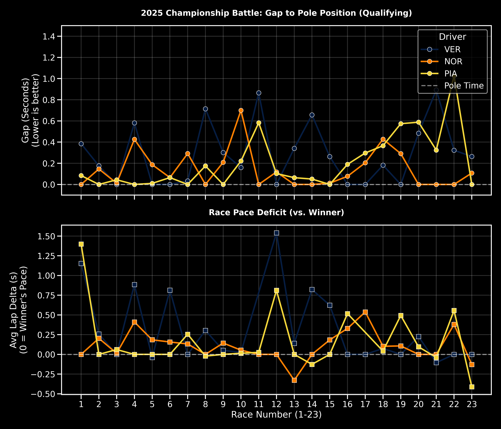

# 🏎️ 2025 F1 Championship Battle: Telemetry Analysis


A data analysis project visualizing the intense 2025 Formula 1 Championship fight between **Max Verstappen (Red Bull)**, **Lando Norris (McLaren)**, and **Oscar Piastri (McLaren)**.

Using the **FastF1** Python library, this project scrapes telemetry data from all 23 completed rounds (only 1 race remaining to determine the CHAMPION) to reveal the momentum shifts throughout the season.

## 📊 Sample Output


*(Run the script to generate this chart dynamically)*

## 🔍 Key Metrics Analyzed

This project focuses on two key performance metrics to determine the "fastest" driver regardless of final race positions:

1.  **Qualifying Pace (Gap to Pole):**
    * Calculates the time difference (in seconds) between the driver's fastest qualifying lap and the Pole Position time.
    * *Lower is better (0.0 means Pole Position).*

2.  **Race Pace Deficit (vs. Winner):**
    * Calculates the driver's average lap time (excluding slow laps, pit stops, and safety cars) compared to the Race Winner's average pace.
    * *Value of 0 means the driver matched the winner's pace.*

## 🛠️ Installation & Setup

1.  **Clone the repository:**
    ```bash
    git clone [https://github.com/kaant7/F1-2025-Championship-Analysis.git](https://github.com/kaant7/F1-2025-Championship-Analysis.git)
    cd F1-2025-Championship-Analysis
    ```

2.  **Create a Virtual Environment (Optional but Recommended):**
    ```bash
    python -m venv venv
    # Mac/Linux:
    source venv/bin/activate
    # Windows:
    venv\Scripts\activate
    ```

3.  **Install dependencies:**
    ```bash
    pip install fastf1 pandas matplotlib seaborn
    ```

## 🚀 Usage

The project is split into two scripts for efficiency:

**Step 1: Collect Data**
Downloads session data for all 23 races and saves it to a CSV file (`f1_2025_champ_data.csv`).
*Note: This process might take a few minutes as it downloads caching data.*
```bash
python collect_data.py
```

**Step 2: Visualize Reads the CSV file and generates the analysis plot (2025_Championship_Analysis.png)**
```bash
python visualize.py
```

📂 Project Structure
├── collect_data.py                   # Script to download and process F1 telemetry data
├── visualize.py                      # Script to generate plots using Seaborn/Matplotlib
├── f1_2025_champ_data.csv            # The processed dataset (output of step 1)
├── 2025_Championship_Analysis.png    # The final chart (output of step 2)
└── README.md                         # Project documentation

📜 License
This project uses data provided by the open-source FastF1 library.
